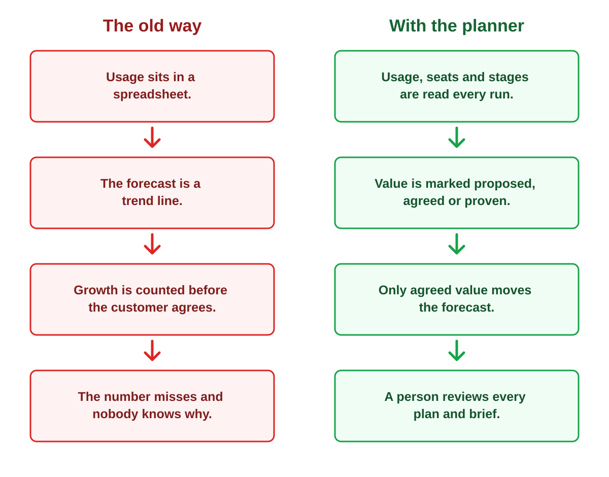

# Account Consumption Planner

Account Consumption Planner reads account usage and shows what next quarter's consumption revenue is likely to be, and which customer-agreed value supports that number. It also drafts the account plans, discovery briefs and deal strategy for a person to review.

*All company names and numbers in this repository are invented for demonstration.*



## What this does

This project turns invented enterprise usage data into account signals, value cases and a next-quarter consumption forecast. It reads monthly tokens, seats, active users and rollout stages for five customer accounts. It connects usage to customer-agreed evidence, account targets and possible pipeline. It also uses the OpenAI API to draft discovery briefs, a deal strategy and account plans for a person to review. It produces separate internal and customer-facing reports so commercial targets do not appear in customer executive reviews.

## Why it matters

When revenue follows usage, a forecast is only as good as the value the customer has agreed. Usage growth without an agreed customer outcome may be interesting, but it is not dependable enough to carry the middle forecast.

## How to run it

You need Python 3 to run the planner. `planner.py` runs with no API key; only the three generator scripts and the optional `hello.py` connection check need an OpenAI API key. Those programs load the key from a local `.env` file into the `OPENAI_API_KEY` environment variable.

1. Open a terminal in this folder.
2. Create a private working environment:

   ```bash
   python3 -m venv .venv
   source .venv/bin/activate
   ```

3. Install the required packages inside that environment:

   ```bash
   python -m pip install -r requirements.txt
   ```

4. Run the planner with no API key or `.env` file required:

   ```bash
   python planner.py
   ```

To run one of the three generator scripts or the optional `hello.py` connection check, copy the safe example file:

   ```bash
   cp .env.example .env
   ```

Open `.env` yourself and replace `your_api_key_here` with your real key. Never put a real key in `.env.example`, any Python file, this README or an output file. The real `.env` file and the local `.venv` folder are excluded by `.gitignore`.

The planner prints the division summary, book totals, value cases, prospect scores, forecast, evidence, pipeline and back-test without using the OpenAI API.

The generator scripts call the OpenAI API and print a draft for review:

```bash
python generate_briefs.py
python generate_deal_strategy.py
python generate_account_plans.py
```

Review their output before replacing any approved Markdown file. `hello.py` is a small connection check that sends “hello” and prints the API reply.

## What each file is

### Source data and setup

- `usage.csv`: twelve months of usage, seats, active users and stage by account and division.
- `cases.csv`: customer objectives, case economics, separate operational measures, expected tokens, status, ownership and estimated ramp.
- `targets.csv`: invented next-quarter consumption revenue targets by account.
- `prices.csv`: the invented planning price per million tokens; it is not any vendor's real price.
- `prospects.csv`: invented prospects, triggers, similar cases, routes in and likely sponsor roles.
- `.env.example`: a safe placeholder showing the required key name; it must never contain a real key.
- `requirements.txt`: the two Python packages and tested versions needed to run the project.

### Programs

- `planner.py`: calculates signals, value-case returns, forecasts, pipeline, prospect rankings and the back-test, then prints the complete planning view.
- `hello.py`: checks that the OpenAI API connection and local key setup work.
- `generate_briefs.py`: sends the chosen prospect facts and value-case evidence to the OpenAI API and prints discovery-call brief drafts.
- `generate_deal_strategy.py`: sends the highest-ranked prospect evidence to the OpenAI API and prints a deal-strategy draft.
- `generate_account_plans.py`: sends each customer's usage, signals, cases and forecast evidence to the OpenAI API and prints five account-plan drafts.

### Outputs and working documents

- `discovery_briefs.md`: the three reviewed prospect discovery briefs, including the author's approved openings.
- `deal_strategy.md`: the reviewed strategy for the highest-ranked prospect.
- `account_plans.md`: five customer account plans with objectives, stakeholders, footprint, risks and quarterly actions.
- `internal_forecast.md`: the sales-leadership view of target, low, middle and high forecasts, gaps, evidence and risks.
- `customer_report.md`: the largest account's customer-facing value and adoption report, with no internal revenue target.
- `corrections.md`: a numbered record of drafts, the author's exact criticism and the fixed version.

## What this shows for an account director or sales leader

The planner shows where usage is growing, declining, stable or new; whether adoption supports expansion; and which customer evidence supports each forecast level. It separates measured value from proposed value, exposes missing sponsors or owners, and shows the revenue gap by account and across the whole book. It also makes recovery accounts, prospecting-stage pipeline and model error visible instead of hiding them inside a single forecast number.

## How the forecast works

- **Low:** continues the current run rate and reduces it when recent usage is declining. A proven case protects confidence in this floor but adds no tokens because its measured usage is already in the run rate; adding it again would double count it.
- **Middle:** starts with low and adds only the estimated share of an agreed case that can realistically go live next quarter. The case must have both a sponsor and an owner, and its ramp percentage is shown as an estimate.
- **High:** starts with middle and adds eligible proposed cases, cases missing a sponsor or owner, and eligible existing-account division pipeline. Division pipeline counts only when active users are above half of seats, a case fits the division's own work, and that case is not already counted. Prospects still at prospecting contribute nothing to next quarter.
- **Recovery rule:** an account in recovery counts no proposed case and no pipeline.

The forecast is deliberately conservative: growth that no agreed case supports appears only in the trend comparison.

## The three-times rule

Case values were set so each agreed or proven case returns at least three times its yearly usage cost, because that is the test I would apply to a real one. This is why several returns sit just above three: they clear the test without pretending to have more evidence than the invented case provides. Proposed cases must return at least two times yearly usage cost, but they still remain outside the middle forecast.

## Honest limits

All data is invented, including every company, person, prospect, trigger and price; nothing was researched. Every plan, brief, note and report is a draft that needs a person's judgment. The straight-line back-test error is shown for every account and for the whole book, and all five account errors are under-forecasts. The largest error belongs to the account where a new division appeared, which a trend line could not foresee. The back-test therefore supports a planning range, not a precise commitment.

## What I corrected

See `corrections.md` for all sixteen logged corrections.

- Signals now describe the last three months with one primary result, while the separate trend column covers twelve months.
- Proven cases no longer add usage on top of the current run rate, and a recovery account carries no proposed case or pipeline.
- Money values now say what economic result they count, while hours, days and events are identified as separate measures rather than the source of the money.

## How I work

The author directs the build by voice, listens to every draft, and approved every opening.
The code was written by OpenAI Codex under the author's direction, and every output was reviewed and corrected by the author.
A second AI model was used as a reviewer; the author approved every correction.
